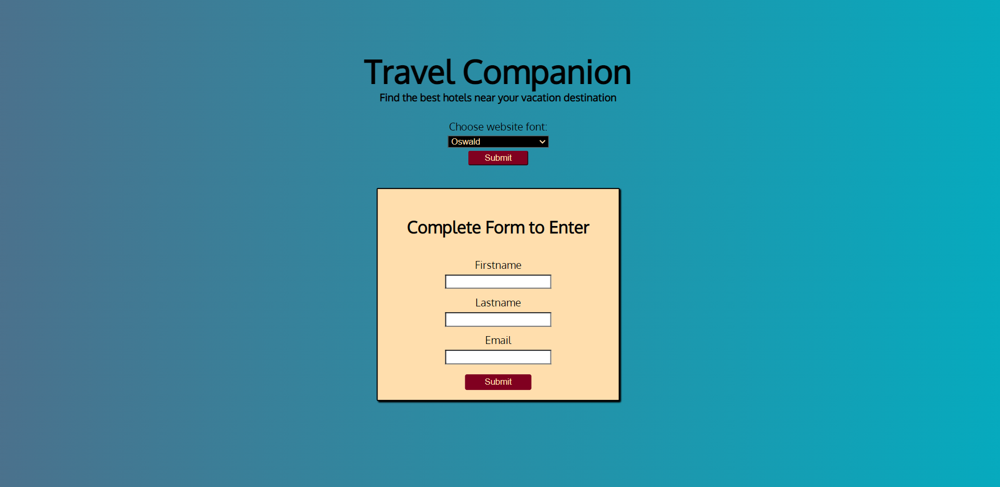

# Travel Companion

- Github repository: https://github.com/glenvasa/Travel-Companion
- Web application that locates hotels (for U.S. and International destinations).
- Developed with HTML, CSS, and JavaScript. 
- Axios HTTP client retrieves data from Hotels API via RapidApi.com
- Local Storage utilized to store user credentials, font and hotel choices, and data retrieved from api calls.

## Screenshots

 

## Features

- Users enter the website via the homepage on which they encounter a dropdown menu that provides ten choices of web fonts to style the website to their preference.
- Users have call to action to complete login form (firstname, lastname, and email address) to enter website and reach Destination page.
- Destinaton page prompts user to enter a city or city/state combination for U.S. and international cities.
- Results Page displays grid of 25 hotels/motels cards related to the user city entry.
- Clicking "More Details" button on card brings user to Details Page on which they can choose to view Hotel Images or Hotel Info.
- Hotel Images option displays various images related to the interior, exterior, and amenities offered by the hotel.
- Hotel Info option displays the current special per night price, describes various amenities, and provides a table of attractions ("What's Around") 
  containing walking/driving distance data.
- Users may navigate to/from/between pages/options via navbar links.

## Technical Information

- Multiple page application developed with HTML, CSS, and JavaScript utlizing axios for HTTP calls to Hotels API (RapidApi.com).
- Homepage offers dropdown menu containing ten web fonts (imported from Gooogle Fonts) that dynamically sets all fonts for the website upon user selection.
- Entry form requires user to enter valid firstname/lastname (only letters allowed) and email address (must contain "@" and ".") which are validated using regex code.
- Destination Page allows user to enter city or city/state combination after which two api calls are made to retrieve data. The first, to obtain the city id based 
  on user entry; the second, to obtain a list of twenty-five (25) hotels/motels in close proximity to the user's selection. 
- CSS animation loading spinner implemented each time an api call is made for better user experience in waiting for data to load.
- Upon choosing to view "More Details" from one of the twenty-five hotel cards, one of two api calls will be made based on user's next selection. 
- "Hotel Info" uses the stored hotel id in an api call to retrieve hotel details including price, amenities, and local attractions with data provided in a table.
- "Hotel Images" uses the stored hotel id to make a different api call which retrieves optimized interior and exterior hotel images displayed in a grid.
- Navigation bar allows users to return to Details Page and make another selection.
- Results link on navigation bar brings user back to the previously displayed 25 hotel cards, Destination link returns user to the "Enter Destination City" form, and 
  "Home" link allows user to make another website font selection and/or enter different login credentials. 

## Deployed Application

- https://travel-companion-22.netlify.app/

